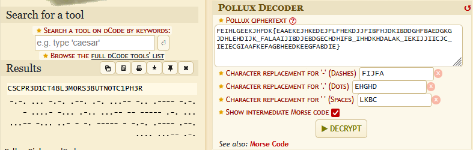

# CHALLENGE_TITLE
The Non Deterministic Cipher

## Category
Cryptography

## Estimated difficulty
Easy

## Description
Hello, my name is Pollux Moore. I have a fascination with algorithms, unpredictability, non-determinism and especially those mathematical relations where one input can map to multiple outputs!
Inspired by this concept, I’ve created what I call an "unbreakable" cipher.
From a single plaintext, you can generate many different ciphertexts!
To show you this, I’ve generated two different ciphertexts from the same plaintext.
Your task is to recover the original message hidden in it:

FEIHLGEEKJHFDK{EAAEKEJHKEDEJFLFHEKDJJFIBFHJDKIBDDGHFBAEDGKGJDHLEHDIJK_FALAAIJIBDJEBDGECHDHIFB_IHHDKHDALAK_IEKIJJIICJC_IEIECGIAAFKEFAGBHEEDKEEGFABDIE}

AGJDCDEGBADJGC{DJFHBGAHBDDGIJLAHGKGIAIACIGJDLFCGDDGFLAGDGLGJEGCGDGAFL_JFCJIFJJKDFEBEEELEDEIIC_IHGDLHHJKIC_JDBFJFIIBJB_IHAEKEFAIFKDJADBGHDEKHGHFFLEAD}

Note: I didn't have time to encrypt the symbols from the flag, so I added the "{" and "_" later, after the encryption process.

## Write-up

Pullox Moore refers to Pullox Cypher: https://www.dcode.fr/pollux-cipher

Knowing the first letters are CSC we can map 

CSC in morse code: -.-. ... -.-.

FEIHLGEEKJHFDK

AGJDCDEGBADJGC

-.-. ... -.-.

dashes replacement: fijfa
dots replacement: ehghd
space replacement: lkbc

## Solve script
`Resources/dec.py`

## Flag
`CSC{PR3D1CT4BL3_M0RS3_BUT_N0T_C1PH3R}`
