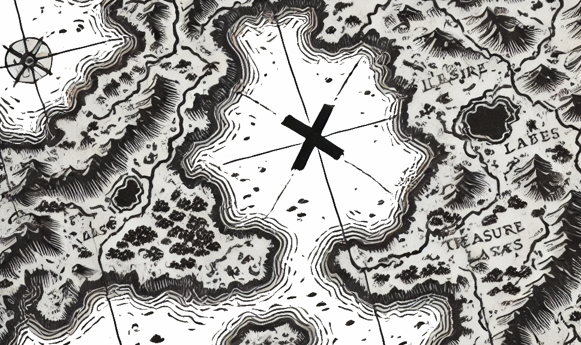
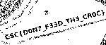

# CHALLENGE_TITLE
Pirates Treasures

## Category
Misc

## Estimated difficulty
Easy

## Description

Captain Hook left us a treasure map, but he hid it well, as any clever pirate would.
He’s left only a portrait of himself as a clue, grinning with that familiar glint in his eye.
Legend says he hides his secrets where no sailor would think to look.
Maybe there's something lurking beneath the surface...

## Write-up

We get a png: Captain_Hook.png

If we throw it in here we can see that binwalk detects more files

https://www.aperisolve.com/

```
┌──(osboxes㉿osboxes)-[~/Desktop]
└─$ binwalk -e Captain\ Hook.png 

DECIMAL       HEXADECIMAL     DESCRIPTION
--------------------------------------------------------------------------------
75            0x4B            Zlib compressed data, default compression
850877        0xCFBBD         Zip archive data, at least v2.0 to extract, name: Treasure/
850948        0xCFC04         Zip archive data, at least v2.0 to extract, uncompressed size: 236, name: Treasure/Captain's Note.txt
851217        0xCFD11         Zip archive data, at least v2.0 to extract, uncompressed size: 982357, name: Treasure/Treasure Map.png
851384        0xCFDB8         Zlib compressed data, default compression

WARNING: One or more files failed to extract: either no utility was found or it's unimplemented
```

Now we go in to the extrected file and we see the following:

We see a note (Note.txt):

You're sharper than this bloody Peter Pan ! But the treasure be still hidden deep mate ! Aye, the X marks the spot, but the island is full of crocodiles ready to devour you. 

Only under the moonlight does the true path reveal itself.

And there's also a treasure map png:



We again throw this png in https://www.aperisolve.com/

Here we can see the flag:



## Solve script

/

## Flag

`CSC{D0N7_F33D_TH3_CR0C}`
