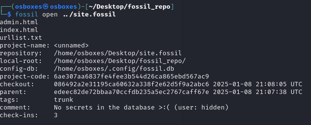
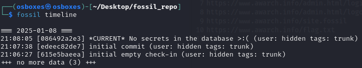
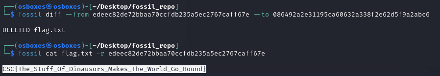

# CHALLENGE_TITLE
Retrofuturistic Archeology

## Category
Web

## Description

You're part of a group of web spelunkers, doing everything they can to find old websites and recover what you can.

This one was recently found, and you've been assigned with recovering the admin's credentials, can you dig hard enough?

Access the server via
http://retrofuturistic_archeology.challenges.cybersecuritychallenge.be

## Write up

It's a whitebox challenge, here is the source code of the application:

```py
<!DOCTYPE html>
<html>
<head>
  <!-- GENERATED BY raptor_site_mapper.rb: files at urllist.txt -->
  <style>
    body {
      background: black url("data:image/gif;base64,R0lGODlhBAAEAKECAAAAAP///////wAAACH5BAEKAAIALAAAAAAEAAQAAAIFhB6nhlUAOw==") repeat;
      color: lime;
      font-family: "Comic Sans MS", cursive;
      text-align: center;
      margin: 0;
      padding: 20px;
    }
    
    .container {
      max-width: 800px;
      margin: 0 auto;
      background: navy;
      border: 5px solid fuchsia;
      padding: 20px;
    }
    
    h1 {
      color: yellow;
      text-shadow: 2px 2px red, -2px -2px blue;
      animation: rainbow 1s infinite;
      font-size: 48px;
      margin-bottom: 30px;
    }
    
    .blink {
      animation: blink 1s infinite;
    }
    
    .marquee {
      background: black;
      padding: 10px;
      border: 3px dashed yellow;
      margin: 20px 0;
    }
    
    .content {
      background: rgba(0, 0, 0, 0.7);
      padding: 20px;
      margin: 20px 0;
      border: 3px double white;
    }
    
    img {
      max-width: 100%;
      height: auto;
      margin: 10px;
    }
    
    @keyframes rainbow {
      0% { color: red; }
      33% { color: yellow; }
      66% { color: lime; }
      100% { color: red; }
    }
    
    @keyframes blink {
      0% { opacity: 1; }
      50% { opacity: 0; }
      100% { opacity: 1; }
    }
  </style>
</head>
<body>
  <div class="container">
    <h1>🏺 AWESOME ARCHAEOLOGY 🏺</h1>
    
    <marquee class="marquee" scrollamount="10">
      <span style="color: red">⭐</span> 
      <span style="color: yellow">WELCOME TO THE RADICAL WORLD OF ARCHAEOLOGY</span> 
      <span style="color: red">⭐</span>
    </marquee>

    <div class="content">
      
      <h2 class="blink" style="color: yellow">⚡ TOTALLY TUBULAR ARTIFACTS ⚡</h2>
      <p style="color: #ff69b4">
        Archaeology is like, the MOST AWESOME way to discover ancient stuff! 
        We dig up cool artifacts and uncover the RADICAL secrets of the past! 
      </p>
    </div>

    <div style="background: rgba(255,105,180,0.3); padding: 20px; margin: 20px 0;">
      <h3 style="color: cyan">🔥 HOT DIGS RIGHT NOW 🔥</h3>
      
      <p style="color: white">
        CHECK OUT these totally gnarly excavation sites:
        <br>→ Pyramid Power in Egypt!!! 
        <br>→ Roman Ruins (RADICAL!!!) 
        <br>→ Mayan Mysteries (SO COOL!)
      </p>
    </div>

    <div style="border: 3px solid lime; padding: 10px; margin-top: 20px;">
      <span class="blink" style="color: #ff69b4; font-size: 24px;">
        💀 UNDER CONSTRUCTION 💀
      </span>
    </div>

    <div style="margin-top: 30px;">
      <a href="/admin.html">Admin Login</a>
      <p style="color: gray; font-size: 12px">
        Best viewed in Netscape Navigator
        <br>Resolution 800x600
      </p>
    </div>
  </div>
</body>
</html>
```

We can see a ```urllist.txt``` file in the source code of the website. Let's try to access it (http://retrofuturistic_archeology.challenges.cybersecuritychallenge.be/urllist.txt):

```
# GENERATED BY raptor_site_mapper.rb
# Remember to re-run after changing, adding, or deleting these files

https://www.awarch.info/
https://www.awarch.info/index.html
https://www.awarch.info/admin.html
https://www.awarch.info/admin.html/login
https://www.awarch.info/admin.html/logout
https://www.awarch.info/site.fossil
https://www.awarch.info/flag.txt
```

We can see that there is a `flag.txt` file. We try to access it but we can't. Let's try to access the `site.fossil` file. It's a SQLite database. We can download it and open it with SQLite Browser.

We will try to use `fossil` because it's in the name of the file:




Now we can scan the timeline:



We can see that the `flag.txt` file was deleted. We can try to recover it:



## Solve script

/

## Flag
`CSC{The_Stuff_Of_Dinausors_Makes_The_World_Go_Round}S`


