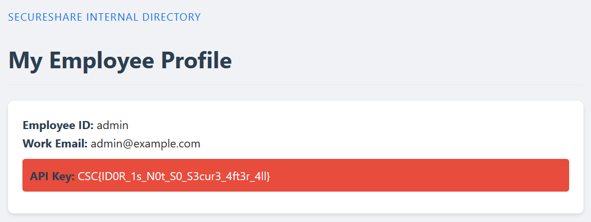

# CHALLENGE_TITLE
Secure Share

## Category
Web

# Challenge description

Welcome to SecureShare, TechCorp's internal employee directory.
Access your profile and view other employees' profiles securely.

Access the server via
http://secure_share.challenges.cybersecuritychallenge.be

## Description

Here is the code of the server:

```py
from flask import Flask, request, render_template, redirect, url_for, session, abort, flash
from functools import wraps
from werkzeug.security import generate_password_hash, check_password_hash
import secrets
import os

app = Flask(__name__)
app.secret_key = 'supersecretkey'  # Secret key for session management

users = {
    1: {
        "username": "user1",
        "email": "user1@example.com",
        "role": "user",
        "verified": True,
        "password": generate_password_hash(secrets.token_urlsafe(20)),
        "api_key": secrets.token_urlsafe(32)
    },
    2: {
        "username": "user2",
        "email": "user2@example.com",
        "role": "user",
        "verified": True,
        "password": generate_password_hash(secrets.token_urlsafe(20)),
        "api_key": secrets.token_urlsafe(32)
    },
    3: {
        "username": "admin",
        "email": "admin@example.com",
        "role": "admin",
        "verified": True,
        "password": generate_password_hash(secrets.token_urlsafe(20)),
        "api_key": os.environ.get("FLAG")
    }
}

# Keep track of the next available user ID
next_user_id = max(users.keys()) + 1

def login_required(f):
    @wraps(f)
    def decorated_function(*args, **kwargs):
        if 'user_id' not in session:
            return redirect(url_for('home'))
        return f(*args, **kwargs)
    return decorated_function

@app.route('/')
def home():
    if 'user_id' in session and session['user_id'] not in users:
        session.pop('user_id', None)
    return render_template('home.html.j2', users=users,
                         error=request.args.get('error'),
                         reg_error=request.args.get('reg_error'))

@app.route('/login', methods=['POST'])
def login():
    username = request.form['username']
    password = request.form['password']

    # Find user by username and verify password
    for user_id, user in users.items():
        if user['username'] == username:
            if check_password_hash(user['password'], password):
                session['user_id'] = user_id
                return redirect(url_for('home'))
            else:
                return redirect(url_for('home', error='Invalid username or password'))

    return redirect(url_for('home', error='Invalid username or password'))

@app.route('/register', methods=['POST'])
def register():
    global next_user_id
    username = request.form['username']
    email = request.form['email']
    password = request.form['password']

    # Check if username already exists
    if any(user['username'] == username for user in users.values()):
        return redirect(url_for('home', reg_error='Username already taken'))

    # Check password strength
    if len(password) < 8:
        return redirect(url_for('home', reg_error='Password must be at least 8 characters long'))

    # Create new user with hashed password
    users[next_user_id] = {
        "username": username,
        "email": email,
        "role": "user",
        # verification is done via the company authentication framework. Ad-hoc profiles default to unverified.
        "verified": False,
        "password": generate_password_hash(password)
    }

    # Auto-login the new user
    session['user_id'] = next_user_id
    next_user_id += 1

    return redirect(url_for('home'))

@app.route('/logout')
def logout():
    session.pop('user_id', None)
    return redirect(url_for('home'))

def load_profile(id=None):
    if id is not None:
        user_id = id
    elif request.args.get('id') is not None and request.args.get('id').isdigit():
        user_id = request.args.get('id')
    elif id is None and 'user_id' in session:
        user_id = session['user_id']
    else:
        return None

    if user_id and int(user_id) in users:
        user = dict(users[int(user_id)])  # Create a copy of the user dict
        user.pop('password', None)  # Remove password hash before passing to template

        return user
    else:
        return None


@app.route('/profile')
@login_required
def profile():
    user = load_profile()
    if user is not None:
        return render_template('profile.html.j2', public=False, **user)
    else:
        return abort(404) # user not found

@app.route('/directory')
@login_required
def directory():
    # Create a list of users without sensitive information
    employee_list = []
    for user_id, user in users.items():
        if user.get('verified', False):  # Only include verified users
            employee_list.append({
                'id': user_id,
                'username': user['username'],
                'email': user['email'],
                'role': user['role']
            })
    return render_template('directory.html.j2', employees=employee_list)

@app.route('/directory/<int:id>')
def directory_info(id: int):
    user = load_profile(id)
    if user is not None:
        user.pop('api_key', None)  # Remove private information
        return render_template('profile.html.j2', public=True, **user)
    return abort(404) # user not found

import logging

# Configure logging
logging.basicConfig(level=logging.INFO)
logger = logging.getLogger(__name__)

@app.errorhandler(404)
def page_not_found(e):
    logger.error(f"Page not found: {e}")
    return render_template('404.html.j2'), 404

@app.errorhandler(500)
def internal_server_error(e):
    logger.error(f"Internal server error: {e}")
    return render_template('500.html.j2'), 500

if __name__ == '__main__':
    app.run(debug=True, threaded=True)
```

We can see that the admin is the user 3 and his API key is stored in the environment variable `FLAG`. The secret to create token is hardcoded in the source code: `supersecretkey`.

We can try to access the `/directory/3` page to get the admin's profile and his API key.

We register ourselves and are now logged in. If we now go to http://secure_share.challenges.cybersecuritychallenge.be/profile?id=3 we get the flag:




## Solve script

/

## Flag

`CSC{ID0R_1s_N0t_S0_S3cur3_4ft3r_4ll}`
